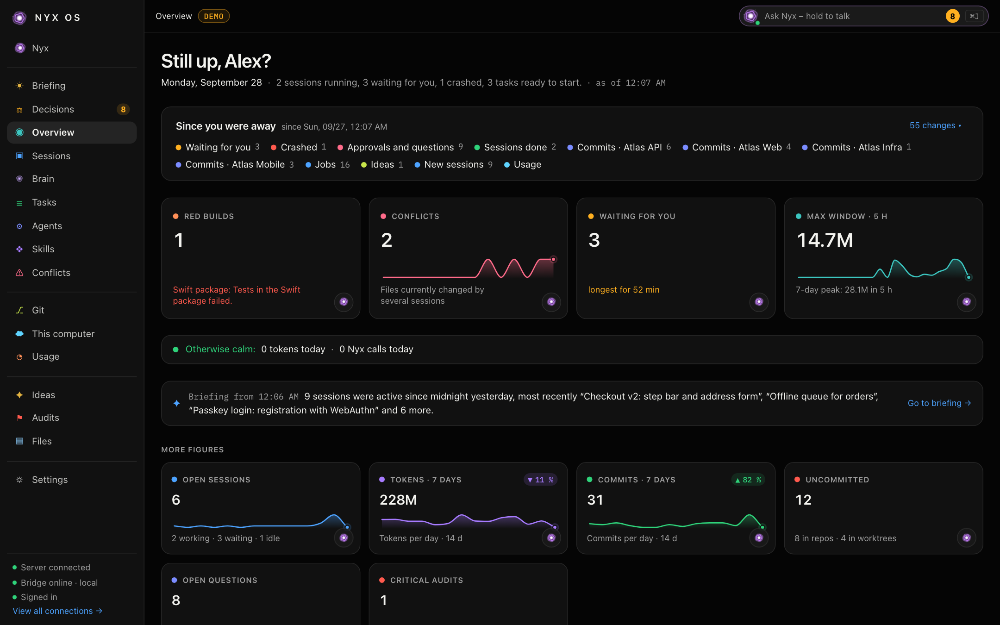
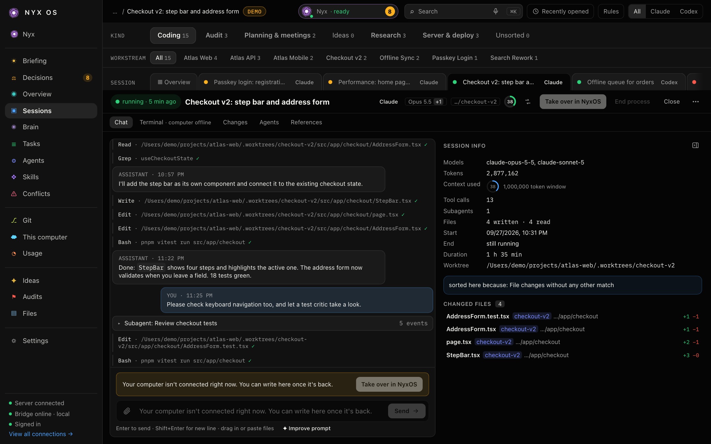
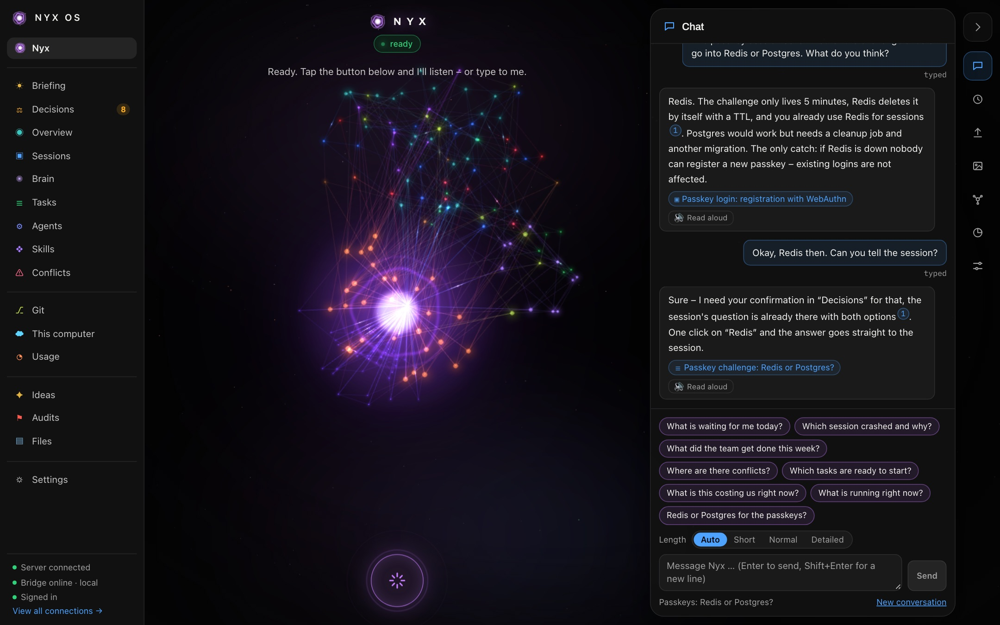

<p align="center">
  
</p>

<h1 align="center">NyxOS</h1>

<p align="center">
  <strong>Die Kommandozentrale für deine Claude-Code- und Codex-Sessions — lokal, privat, im Browser.</strong>
</p>

<p align="center">
  <a href="https://github.com/VariadAgency/NyxOs---Agentic-OS/actions/workflows/ci.yml"></a>
  <a href="https://github.com/VariadAgency/NyxOs---Agentic-OS/releases/latest"></a>
  <a href="LICENSE"></a>
  
</p>

<p align="center"><a href="README.md">English version</a></p>

NyxOS findet jede Claude-Code- und Codex-Session auf deinem Rechner in etwa zwei Sekunden und zeigt sie live:
Chat, Terminal, geänderte Dateien und Subagenten. Es archiviert Verläufe, sortiert Sessions nach Art und
Baustelle und hält Aufgaben, Bugs, Ideen, Audits und Entscheidungen direkt neben der Arbeit, aus der sie
entstehen. Git, Konflikte zwischen parallelen Sessions, Token-Verbrauch und Kosten sind einen Klick entfernt.
Die eingebaute Assistentin **Nyx** gibt dir morgens ein Briefing, fasst abends den Tag zusammen, beantwortet
Fragen — per Text oder Stimme — und kann die Oberfläche für dich bedienen. Push, Merge, Deploy und Löschen
bleiben dabei immer bei dir.

## Schnellstart

```bash
curl -fsSL https://raw.githubusercontent.com/VariadAgency/NyxOs---Agentic-OS/main/install.sh | bash
```

Das ist alles. Etwa eine Minute später öffnet sich dein Browser, und eine Einrichtung in fünf Schritten führt
dich durch den Rest — ohne Node.js, Docker oder Admin-Rechte. Erst mal umsehen? Klick auf der
Willkommensseite auf **Demo ansehen**: die ganze App mit erfundenen Daten, und mit Nyx kannst du schon reden.

<p align="center">
  
  
</p>

## Was NyxOS kann

- **Sessions** — jede Claude-Code- und Codex-Session live: Chat, Terminal (tmux), geänderte Dateien, Subagenten, vollständiges Verlaufs-Archiv
- **Sortierung** — Sessions landen automatisch in Arten (Coding, Audit, Planung, …) und Baustellen; NyxOS lernt aus deinen Korrekturen
- **Aufgaben, Bugs, Ideen, Audits, Entscheidungen** — mit Startklar-Prüfung vor dem Loslegen und einem Entscheidungs-Postfach
- **Git** — offene Änderungen, Branches, Worktrees und Commits über alle deine Projekte
- **Konflikte** — du siehst, wenn zwei Sessions dieselbe Datei ändern, und kannst Pfade reservieren
- **Agenten & Skills** — deine Claude-Code-Agenten und -Skills, wie oft sie genutzt werden, Verbesserungsvorschläge
- **Nutzung** — Tokens und Kosten je Tag, Modell und Projekt, mit Zielen
- **Gehirn** — ein Wissensgraph aus Sessions, Aufgaben und (auf Wunsch) deinem Obsidian-Vault
- **Nyx** — Briefing, Tagesrückblick, Chat, Stimme auf Deutsch und Englisch (läuft auf deinem Rechner, mit einem Klick installiert), Telegram (optional), ein Lernbuch mit Regeln, Nachtmodus
- **Lokal zuerst** — ein Prozess auf `127.0.0.1` mit eingebautem Postgres; kein Docker, kein Cloud-Konto
- Oberfläche auf **Deutsch und Englisch**

## Voraussetzungen

| | |
|---|---|
| Betriebssystem | macOS 13 oder neuer, oder Linux (jede Distribution; systemd empfohlen) |
| Prozessor | x64 oder arm64 (Apple Silicon und Intel) |
| Empfohlen | [Claude Code](https://docs.anthropic.com/en/docs/claude-code) und/oder [Codex](https://github.com/openai/codex) — die Werkzeuge, die NyxOS beobachtet |
| Kommt automatisch | Node.js (eigene Kopie) und `tmux` (Terminal-Ansicht) |

## Deine Daten bleiben auf deinem Rechner

- NyxOS hört nur auf `127.0.0.1` und speichert alles in `~/.nyxos/data`. Kein Konto, keine Telemetrie,
  keine NyxOS-Cloud.
- **Nyx** spricht mit der KI, die *du* verbindest: dein Claude-Abo (über den Befehl `claude`), ein
  API-Schlüssel oder ein komplett lokales Modell mit Ollama oder LM Studio.
- **Updates**: einmal am Tag fragt NyxOS bei GitHub, ob es eine neue Version gibt. Dabei wird nichts über dich
  gesendet.
- **Stimme** (optional): Spracherkennung und Sprachausgabe laufen auf deinem Rechner. Nichts wird hochgeladen.
  Installieren mit einem Klick unter Einstellungen → Nyx → Stimme (oder `nyxos voice install`), siehe
  [Voice](docs/guide.md#voice).
- Telegram, Push-Nachrichten oder ElevenLabs werden nur angesprochen, wenn du sie selbst einrichtest.

Mehr in [SECURITY.md](SECURITY.md) und [Architektur](docs/architecture.md#security-model).

## Was der Installer macht

1. lädt Node.js 24 nach `~/.nyxos/runtime` (dein System-Node bleibt unberührt) und prüft die SHA-256-Summe,
2. installiert `tmux`, falls es fehlt (Homebrew, apt, dnf, pacman oder zypper),
3. lädt die neueste Version, prüft ihre SHA-256-Summe und entpackt sie nach `~/.nyxos/app`,
4. wählt einen freien Port (47800, außer der ist belegt) und richtet die Hintergrunddienste ein
   (launchd auf macOS, systemd `--user` auf Linux),
5. öffnet NyxOS im Browser mit einem einmaligen Anmelde-Link.

Auf einem Server ohne Bildschirm zeigt er den Link zusammen mit dem `ssh -L`-Befehl, um ihn vom Laptop aus zu
öffnen. Öffne danach ein neues Terminal-Fenster, damit der Befehl `nyxos` gefunden wird.

## Erste Schritte

Die Einrichtung dauert ein paar Minuten:

1. **Name und Sprache** — wie Nyx dich ansprechen soll, Deutsch oder Englisch. Oder erst **Demo ansehen**.
2. **KI verbinden** — dein Claude-Konto (über den Befehl `claude`), Codex, ein Anthropic- oder
   OpenAI-kompatibler API-Schlüssel oder ein lokales Modell mit Ollama oder LM Studio. Lässt sich überspringen.
3. **Kurzes Interview** — Nyx stellt ein paar Fragen und schlägt eine Persönlichkeit vor.
4. **Einrichten** — NyxOS findet deine Projektordner selbst (dort, wo du schon mit Claude oder Codex
   gearbeitet hast); ein Klick wählt sie aus. Optional dein Obsidian-Vault und die Hooks, mit denen NyxOS
   neue Sessions sofort sieht.
5. **Dashboard** — deine persönliche Startseite.

Starte jetzt eine Claude-Code- oder Codex-Session in einem deiner Projektordner. Sie erscheint in etwa zwei
Sekunden unter **Sessions**. Mehr in [Erste Schritte](docs/getting-started.md).

## Demo ausprobieren

Klick in der Einrichtung auf **Demo ansehen**, oder im Terminal:

```bash
nyxos demo
```

Startet eine zweite, getrennte Instanz mit erfundenen Sessions, Aufgaben und Nutzung. Deine echten Daten
bleiben unberührt. Jeder Start bringt frische Demo-Daten (`--keep` behält den letzten Stand). Beenden mit
Strg+C.

## Befehle für den Alltag

| Befehl | Was er tut |
|---|---|
| `nyxos open` | NyxOS im Browser öffnen (angemeldet) |
| `nyxos status` | Zustand von Server und Brücke |
| `nyxos restart` / `nyxos stop` | Server und Brücke neu starten bzw. anhalten |
| `nyxos logs [-f]` | Logs zeigen (`-f` folgt ihnen) |
| `nyxos doctor` | Voraussetzungen prüfen und Tipps geben |
| `nyxos update` | Auf die neueste Version aktualisieren |
| `nyxos demo [--keep]` | Demo mit erfundenen Daten starten |
| `nyxos voice install \| status \| remove` | Stimme: Zuhören und Sprechen, lokal (optional, etwa 1 GB) |
| `nyxos uninstall [--purge]` | NyxOS entfernen (`--purge` löscht auch deine Daten) |
| `nyxos version` | Installierte Version anzeigen |

## Aktualisieren

NyxOS schaut einmal am Tag bei GitHub Releases nach. Ist **Einstellungen → Info & Hilfe → automatische
Updates** an (Standard), installieren sich neue Versionen selbst; sonst siehst du einen Hinweis. Von Hand:

```bash
nyxos update                               # neueste Version
nyxos update --version 0.1.0               # eine bestimmte Version (auch zum Zurückgehen)
nyxos update --from ./nyxos-0.1.0.tar.gz   # aus einer heruntergeladenen Release-Datei
```

Jeder Download wird gegen seine SHA-256-Summe geprüft. Die letzten drei Versionen bleiben in
`~/.nyxos/app/versions` liegen.

## Deinstallieren

```bash
nyxos uninstall           # entfernt Dienste, Hooks, PATH-Eintrag und die App; ~/.nyxos/data bleibt
nyxos uninstall --purge   # entfernt alles, auch deine Daten
```

Die Hooks von NyxOS werden aus `~/.claude/settings.json` und `~/.codex/hooks.json` entfernt; deine anderen
Einträge bleiben.

## So funktioniert es

```
 Claude-Code-/Codex-Sessions              dein Browser
 (~/.claude, ~/.codex, tmux)              http://127.0.0.1:47800
          │                                      ▲
          │ Hooks + Datei-Beobachter             │ HTTP + WebSocket (Anmelde-Cookie)
          ▼                                      │
 ┌──────────────────┐  Maschinen-Token  ┌────────┴──────────────────────┐
 │  Brücke          │ ────────────────▶ │  Server (ein Node-Prozess)    │
 │  (Hintergrund-   │ ◀──────────────── │  API · Web-App · Nyx          │
 │   dienst)        │   Befehle         │  PGlite (Postgres) in         │
 └──────────────────┘                   │  ~/.nyxos/data                │
                                        └───────────────────────────────┘
```

- Die **Brücke** beobachtet deine Session-Dateien, nimmt Hook-Ereignisse an, führt Terminals in tmux aus und
  reicht alles an den Server weiter. Ist der Server kurz weg, puffert sie.
- Der **Server** speichert Sessions, Aufgaben und Einstellungen in einem eingebauten Postgres (PGlite), liefert
  die Web-App aus und betreibt Nyx. Er hört nur auf `127.0.0.1`.
- Der Befehl **`nyxos`** installiert, startet, aktualisiert und entfernt alles.

Details: [Architecture](docs/architecture.md) (Englisch).

## Server-Modus (optional)

Du willst NyxOS lieber auf deinem eigenen Server betreiben? In `infra/` liegt ein Docker-Compose-Aufbau mit
Postgres und optionalen Containern für Stimme, Push-Benachrichtigungen (ntfy) und Container-Logs (Dozzle).
Die Brücke auf deinem Rechner verbindet sich über einen SSH-Tunnel oder Tailscale. Siehe
[Server mode](docs/server-mode.md) (Englisch).

## Sprache

Die Oberfläche gibt es auf **Deutsch** und **Englisch**. Umschalten unter **Einstellungen → Info & Hilfe**.
Der Befehl `nyxos` und der Installer folgen deiner Systemsprache. Du willst eine Sprache ergänzen? Siehe
[Translations](docs/translations.md) (Englisch).

## Dokumentation

Die ausführliche Dokumentation ist auf Englisch:

| | |
|---|---|
| [Getting started](docs/getting-started.md) | Installation, Einrichtung, erste Session, wo die Daten liegen |
| [Guide](docs/guide.md) | Rundgang durch jeden Tab und Nyx |
| [Troubleshooting](docs/troubleshooting.md) | Wenn etwas nicht klappt |
| [Configuration](docs/configuration.md) | Umgebungsvariablen |
| [Architecture](docs/architecture.md) | Bausteine, Datenfluss, Sicherheitsmodell |
| [Server mode](docs/server-mode.md) | NyxOS mit Docker Compose betreiben |
| [Translations](docs/translations.md) | Wie die Übersetzung funktioniert, neue Sprache ergänzen |
| [Releasing](docs/releasing.md) | Für Maintainer |

## Mitmachen

Beiträge sind willkommen — siehe [CONTRIBUTING.md](CONTRIBUTING.md) und unseren
[Verhaltenskodex](CODE_OF_CONDUCT.md). Sicherheitslücken bitte vertraulich melden, wie in
[SECURITY.md](SECURITY.md) beschrieben.

## Lizenz

[MIT](LICENSE) © 2026 NyxOS contributors. Hinweise zu fremdem Code: [NOTICE](NOTICE).
